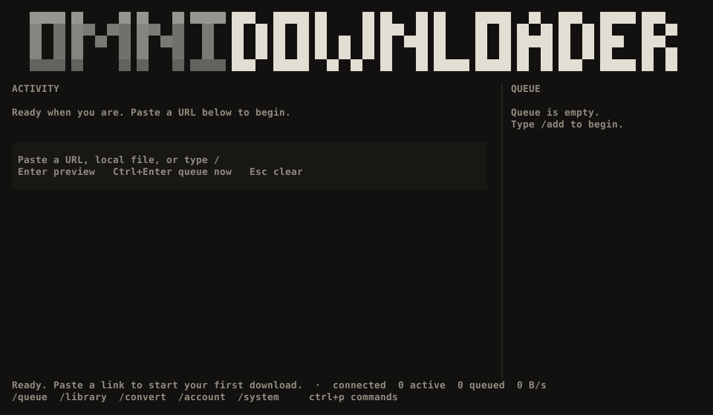

# OmniDownloader

<p align="center">
  
</p>

<p align="center">
  A terminal-first download manager with a persistent queue, background worker, and command-driven TUI.
</p>



## Features

- Direct HTTP downloads with validated resume support and collision-safe output.
- Video, audio, and playlist downloads through yt-dlp.
- Media conversion through FFmpeg.
- Optional torrent and magnet support through aria2.
- Persistent SQLite queue shared by the TUI and scriptable CLI.
- Background worker with cancellation, recovery, and concurrent clients.
- Local cookie accounts, dependency diagnostics, and redacted logs.
- Keyboard and mouse interaction with fuzzy slash-command suggestions.

## Install

### Windows release

Download `omnidownloader-windows-x86_64.exe` from the latest GitHub release, rename it to `omnidownloader.exe`, and place it in a directory on `PATH`.

Then open the TUI from any terminal:

```powershell
omnidownloader
```

### Cargo

```text
cargo install --git https://github.com/ASVLCII/OmniDownloader --locked
omnidownloader
```

## TUI

Click the composer or press `/` to search commands. Arrow keys change the highlighted suggestion, Enter accepts it, and Enter again runs the completed command.

```text
/add       Download a URL, magnet, torrent, or list
/queue     View and control downloads
/library   Browse and export completed files
/convert   Convert a local media file
/account   Manage local cookie accounts
/system    Check tools, settings, plugins, and worker status
/help      Show commands and shortcuts
/quit      Exit safely
```

Pasting a URL opens a preview. Pasting a local media path opens conversion. `Ctrl+Enter` queues composer input immediately.

## CLI Examples

```powershell
omnidownloader download "https://example.com/file.zip" --direct --detach
omnidownloader info "https://example.com/video"
omnidownloader batch links.txt
omnidownloader queue list
omnidownloader queue pause <JOB_ID>
omnidownloader queue resume <JOB_ID>
omnidownloader auth import-cookies cookies.txt --name personal
omnidownloader convert clip.mov --format mp4 --detach
omnidownloader doctor
omnidownloader worker status
```

Add `--json` for newline-delimited machine-readable output. Use `--data-dir <profile>` to isolate application data.

## Optional Tools

OmniDownloader discovers configured tools through `PATH` and known executable locations. It never silently installs or updates them.

- [yt-dlp](https://github.com/yt-dlp/yt-dlp) for media sites and playlists
- [FFmpeg](https://ffmpeg.org/) for conversion
- [aria2](https://aria2.github.io/) for torrents and magnet links

Run `omnidownloader doctor` or `/system doctor` to inspect the current setup.

## Build

```powershell
$env:OMNIDOWNLOADER_WINDOWS_SDK = 'C:\path\to\Windows-SDK-Lib-version'
.\Build.ps1 test
.\Build.ps1 lint
.\Build.ps1 release
```

The Windows binary is written to `dist\omnidownloader.exe`. Standard Cargo builds are used on Linux and macOS.

## Verification

The controlled test harness covers formatting, Clippy with warnings denied, unit and engine tests, direct HTTP integrity, redirects, resume validation, destination collisions, worker recovery, concurrent clients, subprocess cleanup, plugin boundaries, yt-dlp against local media, and real Windows ConPTY keyboard/mouse interaction.

Live third-party providers, course adapters, browser callback authentication, and release packaging on every supported platform still require platform-specific validation.

## License

[MIT](./LICENSE)
